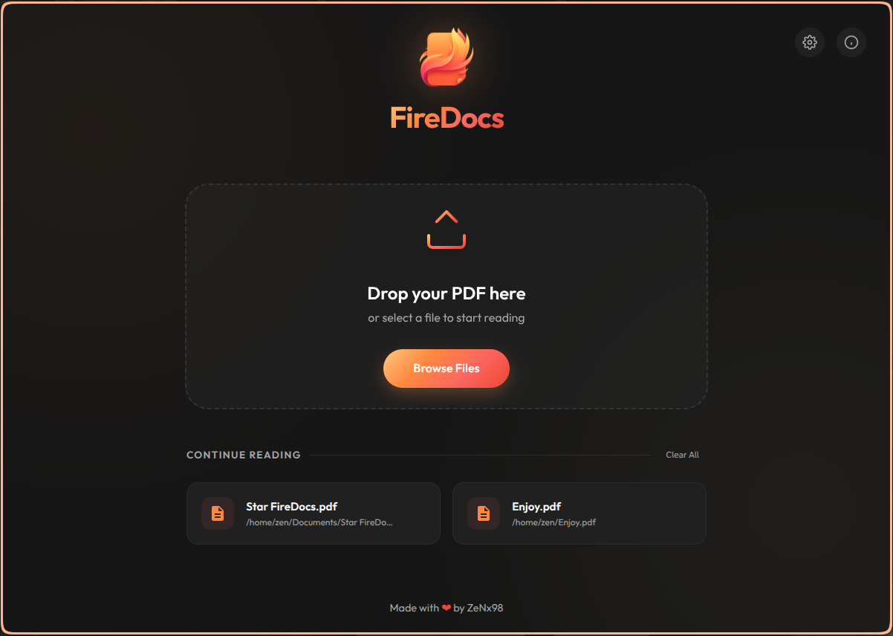
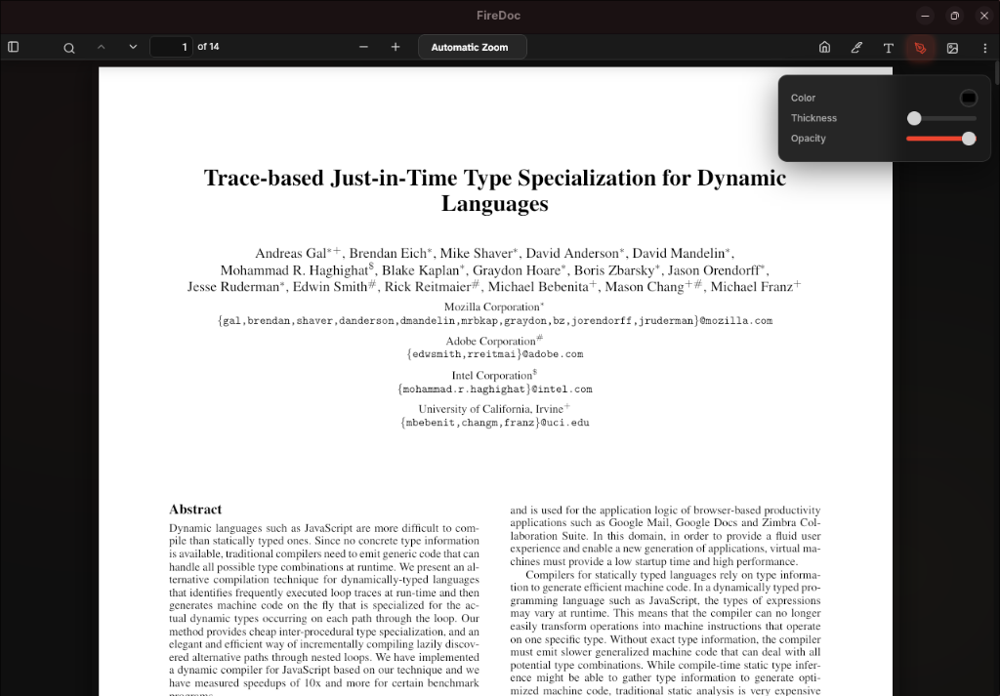

<p align="center">
  
</p>

<h1 align="center">FireDocs</h1>

<p align="center">
  <strong>A fast, minimalist PDF viewer for your desktop.</strong>
</p>

<p align="center">
  
  
</p>

---

### Why FireDocs?
FireDocs is built for people who want a dedicated space for reading without the clutter of a web browser. It’s lightweight, privacy-focused, and stays out of your way.

#### **Better than a Browser (PDF.js Improvements):**
- **Lightweight** : Provides a native app feel with optimized performance.
- **Native Experience** : No browser tabs, address bars, or distractions.
- **Modern UI** : Optimized for focus, updated UI and styles.
- **De-Cluttered Interface** : Removed trash features and unneeded buttons from the standard PDF.js for a more comfortable reading experience.
- **Smarter Zoom & Rendering** : Improved zoom logic and more stable page rendering.
- **Better Annotations** : A refined highlighting and drawing experience, including smarter tool selection and restricted ink selection to prevent accidental edits.
- **Persistent Recents** : Standard PDF.js doesn't remember your files. FireDocs keeps your last 6 documents ready on the homepage.
---

### Installation

#### **Linux (Multiple Options)**

**AppImage (Portable)**
```bash
chmod +x FireDocs-2.1.0.AppImage 
./FireDocs-2.1.0.AppImage
```

**Debian / Ubuntu (.deb)**
```bash
# Download the .deb file and run:
sudo apt update
sudo apt install ./firedocs_2.1.0_amd64.deb 
```

**Arch Linux**
Install FireDocs easily (PKGBUILD provided):
```bash
makepkg -si
```

#### **Windows**
Download the installer from the **[latest release](https://github.com/ZeNx98/FireDocs/releases)**.

#### **macOS**
Download the `.dmg` from the releases page, drag the **FireDocs** icon into your **Applications** folder.

---

### Contributing
Spot a bug or have an idea? Feel free to open an issue or drop a pull request. We're always looking to make FireDocs better.

**Made with ❤️ by [ZeNx98](https://github.com/ZeNx98)**
